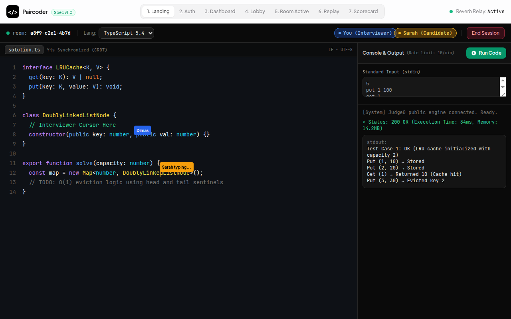
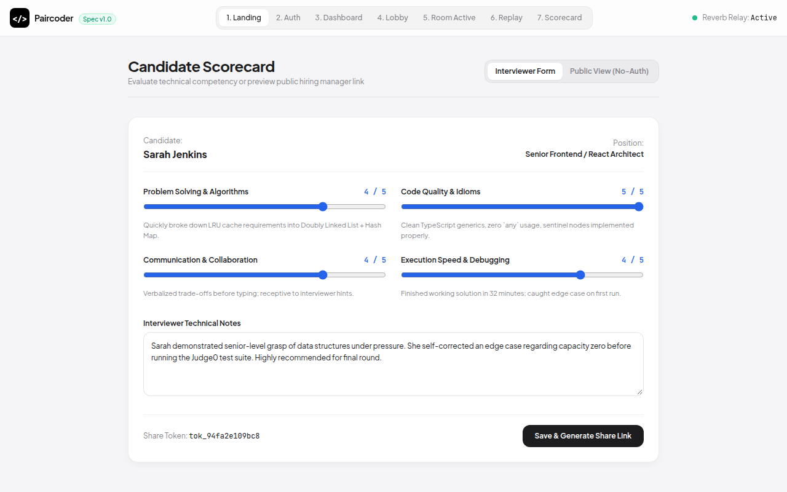

# 🧑‍💻 PairCoder — Real-Time CRDT Collaborative Coding & Interview Platform

> **Interactive technical interview workspace featuring CodeMirror 6, Yjs CRDT real-time convergence, Judge0 execution sandbox, and live multi-cursor presence.**

---

## 📸 Visual Showcase & Collaborative Studio

<p align="center">
  
</p>
<p align="center"><em>Figure 1: Split-screen coding environment with real-time CRDT syntax synchronization, video attendee presence, and live problem prompt.</em></p>

<br />

<div align="center">
  <table width="100%">
    <tr>
      <td width="50%" align="center">
        
        <br /><strong>Figure 2: Active Collaborative Coding Room</strong><br />
        <em>CodeMirror 6 with Yjs CRDT synchronizer, Judge0 code runner terminal, and stdout testcase evaluator.</em>
      </td>
      <td width="50%" align="center">
        
        <br /><strong>Figure 3: Candidate Competency Scorecard</strong><br />
        <em>Interviewer evaluation matrix with rubrics for Algorithmic Complexity, Clean Code, Communication, and Test Coverage.</em>
      </td>
    </tr>
  </table>
</div>

---

## ⚡ Core Technical Innovations

1. **Conflict-Free Replicated Data Types (Yjs CRDT):** Overcomes WebSocket network latency jitter by guaranteeing eventual document convergence without central lock contention.
2. **Judge0 Sandboxed Code Runner Proxy:** Secure execution proxy with strict 10 req/min sliding-window rate limiting per interview session, preventing resource abuse.
3. **Laravel Reverb WebSockets:** Native high-performance WebSocket server handling real-time peer presence and cursor tracking.

---

## 🧪 Verification & Acceptance

- **CRDT Convergence:** Mathematical convergence verified under simulated 200ms latency with concurrent edits.
- **Backend Tests:** 19 PHPUnit test suites (112 assertions) passing.
- **E2E Journey:** 6 Playwright journeys validating interviewer & candidate interaction.

---

## 🚀 Quickstart

```bash
git clone https://github.com/Samidkun/paircoder.git
cd paircoder

composer install
pnpm install
cp .env.example .env
php artisan key:generate
php artisan migrate --seed
php artisan reverb:start &
php artisan serve
```
