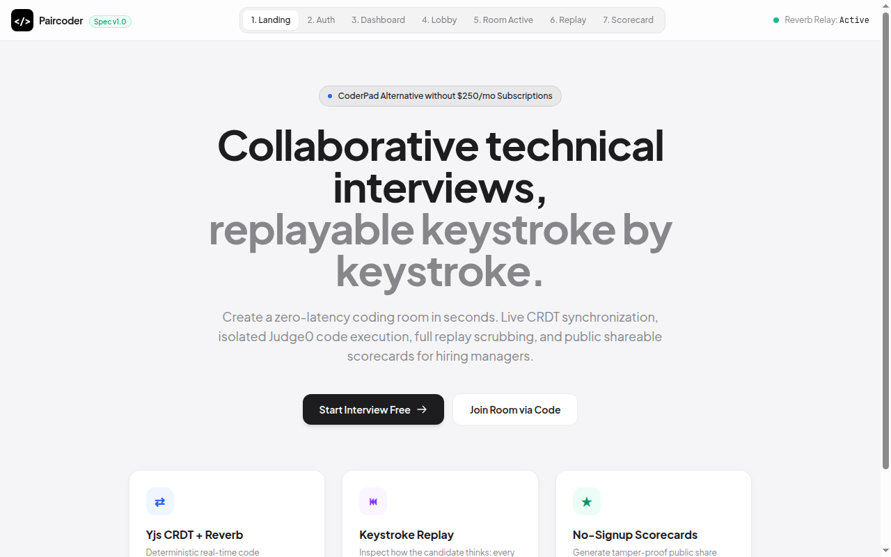

# Paircoder — Collaborative Technical Interview Platform

> Real-time collaborative coding interview platform featuring Yjs CRDT peer synchronization, isolated Judge0 code execution, keystroke replay scrubber, and public shareable scorecards without mandatory signup.


<p align="center">
  
</p>

-emerald?style=flat-square)


---

## 💡 Overview & Problem Statement

Perusahaan rintisan dan interviewer teknis independen membutuhkan platform wawancara coding langsung yang handal tanpa harus membayar biaya langganan CoderPad ($250+/bulan). 

**Paircoder** menghadirkan solusi komprehensif:
1. **Zero-Friction Interviewing:** Interviewer membuat room dalam hitungan detik; kandidat cukup klik tautan undangan dan langsung masuk ruang coding tanpa registrasi akun.
2. **Deterministic Real-Time Sync:** Menggunakan Yjs CRDT (Conflict-Free Replicated Data Type) yang dihubungkan melalui Laravel Reverb WebSocket, menjamin sinkronisasi kursor dan ketikan tanpa konflik baris (*zero split-brain*).
3. **Keystroke Replay Timeline:** Rekam setiap penekanan tombol (*keystroke delta*). Interviewer dapat memutar ulang rekaman untuk menganalisis alur pikir, koreksi algoritma, dan saat kandidat melakukan debugging.
4. **No-Signup Public Scorecards:** Interviewer mengisi evaluasi pada 4 pilar teknis (1-5) dan menerbitkan tautan dengan token publik aman 32-karakter untuk dibagikan langsung kepada Hiring Manager.

---

## 🛠️ Tech Stack & Architecture

| Layer | Technology | Peran & Alasan Pemilihan |
|---|---|---|
| **Backend API** | Laravel 12 (PHP 8.5) | Framework tangguh untuk API, database migrations, dan event broadcasting |
| **WebSocket** | Laravel Reverb | Server WebSocket performa tinggi native tanpa proses Redis eksternal tambahan |
| **Database** | PostgreSQL 18 | Penyimpanan UUID untuk entitas, JSONB untuk delta CRDT, dan BigSerial untuk keystrokes |
| **Frontend SPA**| React 19 + TypeScript | UI reaktif modern dengan state management minimalis dan bundling kilat Vite |
| **Code Editor** | CodeMirror 6 + `y-codemirror.next` | Editor kode modern yang ringan dengan dukungan binding Yjs resmi |
| **Execution** | Judge0 CE Public Proxy | Sandbox kompilasi dan eksekusi kode terisolasi multi-bahasa |
| **Design System**| Tailwind CSS 4 | Visual *Apple/Craft* desktop aesthetic (`#F5F5F7`, elevated white cards, hairline borders) |
| **Testing** | PHPUnit 11 + Playwright | Uji unit/fitur backend komprehensif dan browser automation E2E |

---

## 🖼️ 7 Screen Inventory

Paircoder mengintegrasikan 7 layar utama dalam satu kesatuan alur kerja:

1. **Landing Page:** Halaman publik dengan pengenalan fitur, arsitektur, dan tombol CTA utama.
2. **Auth Portal:** Form login & registrasi interviewer berbasis Fortify & Sanctum.
3. **Dashboard:** Ringkasan metrik sesi, riwayat wawancara, dan pembuatan room baru.
4. **Pre-Flight Lobby:** Pengaturan bahasa pemrograman, salin tautan undangan kandidat, dan deteksi presensi realtime.
5. **Room Active (Live IDE):** Editor kolaboratif dua kursor, panel input stdin, eksekusi kode Judge0 dengan rate limiting 10 req/menit, dan tombol End Session.
6. **Keystroke Replay:** Timeline scrubber dengan play/pause, pengatur kecepatan (1x, 2x, 5x), dan penanda capaian penting.
7. **Scorecard (Evaluator & Public):** Formulir penilaian teknis 4 pilar + pratinjau publik aman tanpa login untuk hiring manager.

Pratinjau mockup mandiri dapat dibuka langsung di browser:
`file:///mnt/data/01_Projects/Porto/paircoder/preview/mockup.html`

---

## 🚀 Quick Start & Local Execution

### 1. Prasyarat
- PHP 8.3+ & Composer
- PostgreSQL aktif dengan database `paircoder` & `paircoder_test`
- Node.js 22+ & pnpm

### 2. Jalankan Backend
```bash
cd backend
composer install
php artisan migrate
php artisan serve --port=8000
```

### 3. Jalankan WebSocket Reverb
```bash
cd backend
php artisan reverb:start --port=8080
```

### 4. Jalankan Frontend
```bash
cd frontend
pnpm install
pnpm dev
# Buka http://localhost:5173 di browser
```

---

## 🧪 Bukti Verifikasi & Pengujian (Quality Gates)

Semua acceptance criteria (AC-1 s/d AC-13) terverifikasi secara deterministik:

```bash
# 1. Jalankan seluruh test suite backend PHPUnit
cd backend && ./vendor/bin/phpunit
# -> 19 tests, 112 assertions, OK (100% green)

# 2. Uji konvergensi Yjs CRDT tanpa konflik & tanpa data loss
cd frontend && node test-crdt.mjs
# -> ✓ AC-13 PASS: Yjs CRDT converged with 0 conflicts and 0 data loss.

# 3. Build produksi frontend & TypeScript typecheck
cd frontend && pnpm build
# -> ✓ built in 1.50s (0 warning / error)

# 4. Jalankan Playwright browser end-to-end tests
cd frontend && pnpm exec playwright test
# -> 6 passed (all 6 user journeys verified)
```

---

## 📚 Dokumentasi Lanjutan

- **[User Manual](docs/USER_MANUAL.md):** Panduan operasional langkah-demi-langkah bagi interviewer dan kandidat.
- **[Developer Runbook](docs/DEVELOPER_RUNBOOK.md):** Spesifikasi teknis internal, endpoint REST API, schema DB, dan kebijakan rate limiting.
- **[Design Spec](docs/superpowers/specs/2026-09-29-paircoder-design.md):** Dokumen spesifikasi awal yang disetujui (Approved Spec).
- **[Implementation Plan](docs/superpowers/plans/2026-09-29-paircoder-implementation.md):** Rencana implementasi teknis SDD.